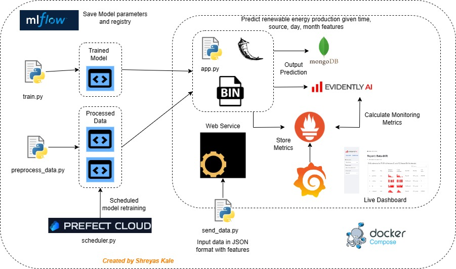

# turbo-fiesta



<h1> Project description</h1>

This is the implementation of final project for the course mlops-zoomcamp from [DataTalksClub](https://github.com/DataTalksClub/mlops-zoomcamp). <br/>
The project provides the **online service** for the prediction of production of energy. The dataset has been taken from [kaggle](https://www.kaggle.com/datasets/henriupton/wind-solar-electricity-production). 
- The given input features for the model are date and hour range, date, source (solar/wind), day of the year, name of day of the week, month. 
- In response service give a prediction for production of renewable energy production. <br/>
The main focus of the project is to make a **ML-OPS** service with experiment tracking, pipeline automation, observability rather than building **the most accurate** prediction model. <br/>

<h1> High-level overview</h1>

The project is implemented on local machine. The described steps for reproducbility are based on specific configuration and may be different based on the production platform (GCP, Azure, locally, and so on). The instruction about reproducibility of a project can be found in the actual readme. <br/>

In the folder *src* the main source code is provided with various configuration files for docker and existing databases.<br/>

### High-level overview

*The picture with "system design" can be used in order to understand the working schema of a current project.* <br/>

The script *preprocess_data.py* is used as a main code for reading the dataset, transforming it and splitting into train, test validation to finally save them as binaries using dict vectorizer. <br/>

The script *train.py* is used as a main code for creating of a model, promoting it to the model registry and saving as pickle file. [Mlflow](https://mlflow.org/) is used as a main instrument for experiment tracking and model registry. The results of experiment are saved to the final_project.db. <br/>

The script *schedule_deployment.py* is used for the scheduling the deployment of a model. [Prefect](https://www.prefect.io/) has been used as a main workflow orchestrator in this project. The training pipeline is automated and can be deployed with different time intervals. <br/>

After the model is trained, the simulation of traffic is done in *send_data.py* script. It reads the rows from *test.csv* file and send it to the Flask application. It sends input features in JSON format to the prediction service with time difference of 1 second. In responce, service gives an prediction for renewable energy production. The prediction service depends on MongoDB, Evidently and in turn Promotetheus and Grafana. To simulate the traffic, start prediction service and evidently service and use the send data script.

The whole application can be started by running docker compose file. It runs the Flask application  with a service that has current model and ensures observability by a combination of [Grafana](https://grafana.com/), [Prometheus](https://prometheus.io/) and [Evidently](https://github.com/evidentlyai).

<h1> Quick start </h1>

##### Step 1
copy this .git folder by running 
```
https://github.com/KaleShreyas/turbo-fiesta
```

##### Step 2
Navigate into the *src* repository and run: the below to install all required dependencies and activate the working environment. 
```
pipenv shell
```
##### Step 3
After the pipenv environment is activated, the whole application can be started by running 
```
docker-compose up --build
```
##### Step 4
In order to simulate the production service and send data to the running Flask application, the following command should be written: 
```
python send_data.py
```
##### Step 5
In order to ensure observability of a given service, it is possible to reach Grafana on
```
http://localhost:3000/
```
##### Step 6
All previous steps are used for **starting** the service, in order to **change** some parts of a service or prove its functionality, the steps described below can be run. For example, training the new model can be done by running :
```
python train.py
```
This script takes the input data, randomly choose random state, performs train test split, does feature engineering, save dictionary vectorizer -> then train, test & valid pickle files and model.pkl files.<br/>
In order to see experiment tracking, MlFlow should be started by: 

```
mlflow server --backend-store-uri sqlite:///final_project.db --default-artifact-root ./artifacts
```
The user interface can be achieved on: 
```
http://localhost:5000/
```

##### Step 7

This service has an automated workflow and Prefect is used as a main workflow orchestrator. In order to start Prefect, the followed commands should be written: 
```
prefect config set PREFECT_ORION_UI_API_URL="http://<external ip>:4200/api", where <external ip> is an ip address of a remote server
prefect config set PREFECT_API_URL=http://0.0.0.0:4200/api
prefect orion start --host 0.0.0.0
```

The deployment is managed in file *schedule_deployment.py*, originally it has a Cron schedule, but can be changed for different version. 

```
prefect deployment create schedule_deployment.py 
```
